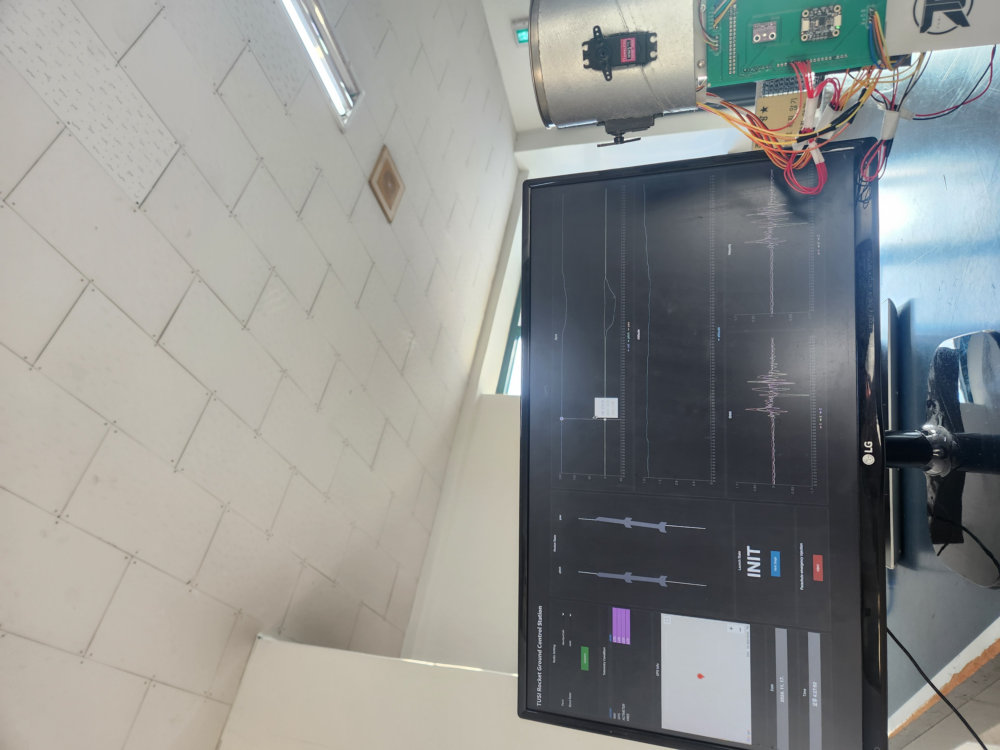

## Tusi Rocket Ground Control Station

이 로켓 지상 관제 시스템 소프트웨어입니다.

로켓에서 오는 무선 신호를 수신한 아두이노에서 pc로 파싱한 데이터를 보내주고 이 소프트웨어는 그 데이터를 해석하여 디스플레이합니다. 또한 로켓으로 미션 수행에 대한 각종 명령을 전송하여 로켓의 운용을 관제할 수 있습니다.

### 주요 기능
- 로켓 신호를 수신하는 아두이노와의 연결을 관리할 수 있다.
- 자이로, 가속도, 고도, GPS 데이터를 시각화 하여 준다.
- 로켓의 현재 발사 단계에 대한 정보를 보여준다.
- 로켓의 비상 낙하산 사출 명령을 내릴 수 있다.

## 소프트웨어 아키텍쳐
</img>

</img>
</img>